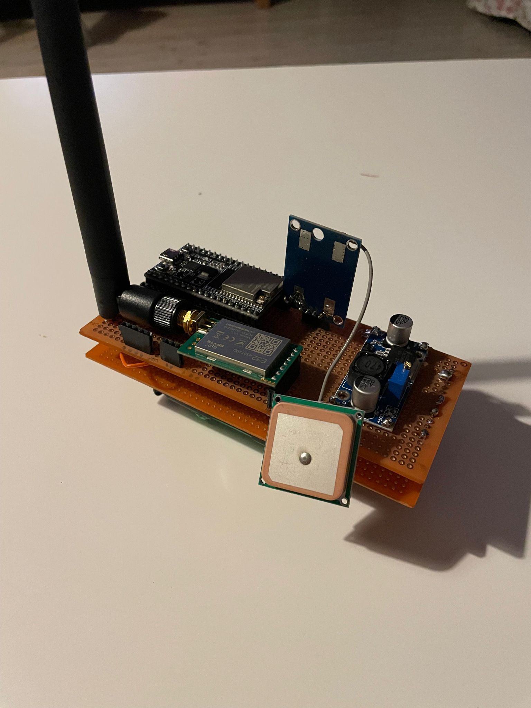
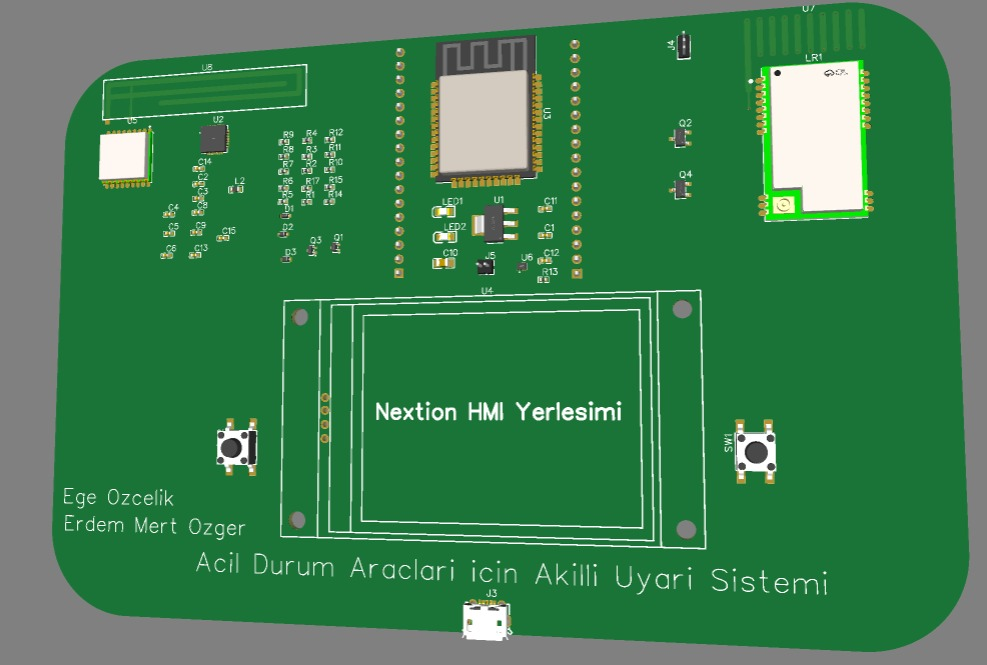
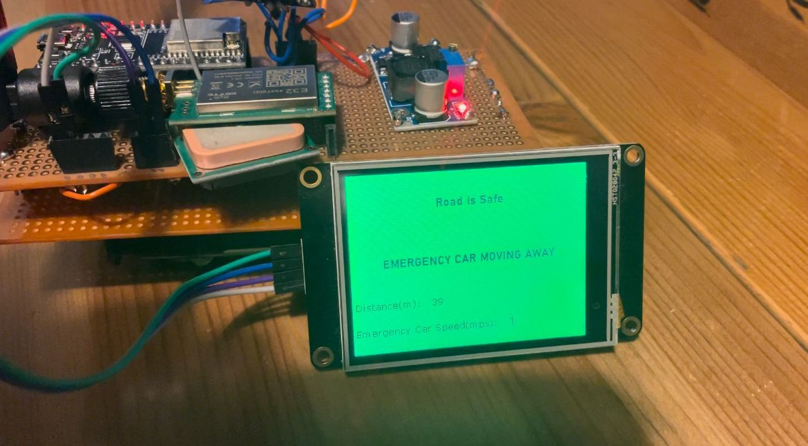
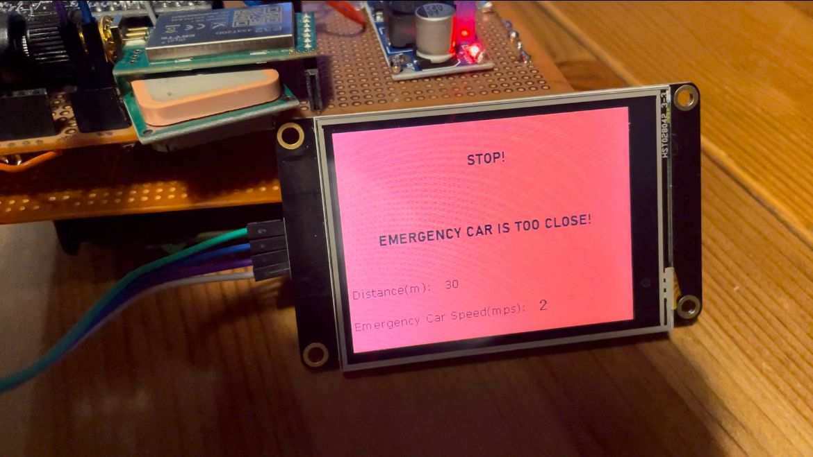

# V2V Smart Communication for Emergency Vehicles with GPS Tracking

## Overview
V2V Smart Communication for Emergency Vehicles is a project aimed at enabling wireless communication and location sharing among emergency vehicles. The system enhances the efficiency and effectiveness of emergency response by allowing vehicles such as ambulances and fire trucks to communicate with each other. It facilitates improved traffic coordination and enhanced safety measures.

The project utilizes LoRa (Long Range) wireless communication technology, which provides long-range coverage with low power consumption. It involves the use of LoRa modules, LoRa antennas, Arduino or similar microcontrollers, GPS modules, and OLED displays.

LoRa modules are responsible for wireless communication between emergency vehicles and a central control point. They offer the advantages of low power consumption and long-range communication capabilities. GPS modules accurately determine the location information of each vehicle, enabling real-time sharing of location data among the vehicles.

An Arduino or similar microcontroller is employed to control the system components. It facilitates the connection of LoRa modules and GPS modules, as well as the processing and display of received data. OLED displays are utilized to provide visual output of important information, allowing vehicles and the control center to read the received data, such as distance information.

## Features
- LILYGO T-BEAM-V1.1 and Arduino IDE is used.
- Wireless communication between emergency vehicles(Transmitter) and civilian cars(Receiver) using LoRa technology.
- Accurate location tracking and sharing through GPS modules.
- Efficient traffic coordination and awareness also enhanced safety measures.
- Real-time distance calculation and display.
- Low power consumption and long-range communication.

## Installation
1. Clone this repository.
2. Connect the LoRa modules, GPS modules, Arduino, and OLED displays if you use separate modules and microcontroller as per which fits for your project. If you use a Lilygo t-beam or that kind of module, it is come with connected by itself.
3. Upload the needed receiver code to the civilian cars module. I uploaded via Arduino IDE but there are also alternatives.
4. Upload the needed transmitter code to each emergency vehicle's module.
5. Power up the devices and ensure they are within LoRa communication range.(433MHz, 868MHz, 915MHz,..)

## Usage
- Ensure that the emergency vehicles are equipped with the necessary hardware components.
- Power on the devices and wait for the LoRa communication to establish and GPS led's blink.
- The vehicles will start communicating with each other and exchanging location data.
- The OLED displays will show the received distance information.
- Change the information according to your project to coordinate traffic and optimize emergency response.

# CODES

## Transmitter
The transmitter code implements a project where an Arduino device receives GPS data and transmits it to another device using a LoRa (Long-Range, Low-Power) module. Here's a general overview of what the code does:

Library and Constants Definition:

The "LoRa_E32.h" and "SoftwareSerial.h" libraries are included.
RX and TX pins are set for the LoRa module.
RX and TX pins are set for processing GPS data using the "TinyGPSPlus.h" library.
Definition of Data Structure:

A structure named "veriler" is defined to store GPS data. This structure contains latitude and longitude data.
setup() Function:

Serial communication is set at a baud rate of 9600.
The GPS device's communication speed (baud rate) is set to 9600.
M0 and M1 pins of the LoRa module are pulled low to set the operating modes.
The LoRa module is initialized.
loop() Function:

Acquisition of GPS Data:
As data is received from the GPS device, it is processed, and if valid, the "displayInfo()" function is called.
If valid data is not received within a certain time, an error message is displayed, and the loop is halted.
Reception of GPS data and assignment to the "veriler" structure.
Transmission of data via the LoRa module:
Data is sent to the LoRa module using the "E32.sendFixedMessage()" function.
The response status object "ResponseStatus" is obtained, and information about the result is printed to the serial port.
A specific delay (2 seconds) is applied.
displayInfo() Function:

GPS data is printed to the serial port.
Location (latitude and longitude), date, and time information are displayed.
This code receives GPS data and transmits it to another device through a LoRa module. The LoRa module provides low power consumption and long communication range. After receiving and parsing GPS data, the latitude and longitude information is stored in the "veriler" structure, and these data structures are sent to another device using the LoRa module. Additionally, GPS data is printed to the serial port for tracking purposes.

### Receiver Code
This Receiver code involves programming a device that performs a series of different tasks. I'll summarize the general purpose of the code:

Library and Pin Definitions:

The code starts by including the "LoRa_E32" and "SoftwareSerial" libraries.
Pin definitions are made for two different modules: M0 and M1 pins for the LoRa module, and RX and TX pins for the GPS module.
LoRa Module Initialization:

Serial communication connection for the LoRa module is established using the SoftwareSerial library.
The LoRa_E32 class is initialized.
M0 and M1 pins are set to their respective states (LOW).
GPS Module Initialization:

Serial communication connection for the GPS module is established using the "TinyGPSPlus" library.
Data Structure Definitions:

A data structure named veriler is defined, containing float variables to store latitude and longitude values.
Setup Function:

Serial communication speed is set.
Communication with the GPS module is initiated.
Pin modes are set, and the LoRa module is initialized.
Main Loop:

GPS data is read, and the gps object is updated with this data.
If a valid GPS location is obtained, these data are saved in the rx_Lat and rx_Lng variables.
If a certain amount of time passes and insufficient data is received from the GPS module, an error message is displayed, and the program halts.
It's checked whether data is received from the LoRa module.
If data is received, the received data is converted to the veriler structure, and the respective latitude and longitude values are saved in the tx_Lat and tx_Lng variables.
The distance between the two locations is calculated and printed over the serial port.
The code uses both LoRa and GPS modules to calculate the distance between two locations and displays this information over the serial port. While the GPS module is used to determine the receiver's location, the LoRa module is employed to wirelessly transmit and receive data. This way, you can exchange location data between two different devices and evaluate this data by calculating the distance.

## Acknowledgements
- [TinyGPS++ Library](https://github.com/mikalhart/TinyGPSPlus) - For GPS data parsing.
- [Adafruit SSD1306 Library](https://github.com/adafruit/Adafruit_SSD1306) - For OLED display support.
- [LoRa Library](https://github.com/sandeepmistry/arduino-LoRa) - For LoRa communication.
- [LilyGo T-BeamV1.1](https://github.com/LilyGO/TTGO-T-Beam) - For T-Beam Module
