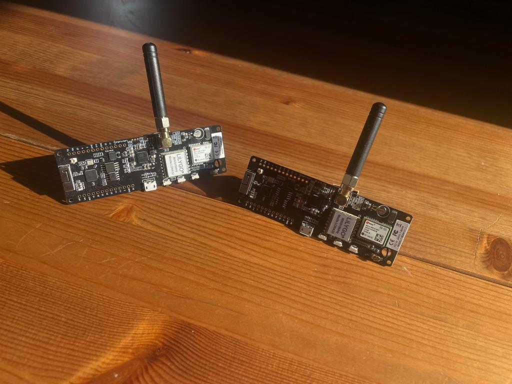
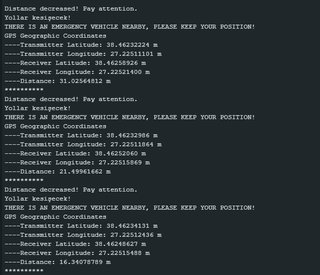
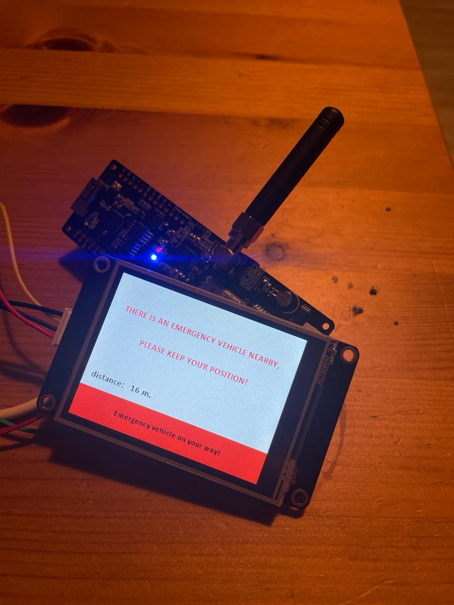

# V2V Smart Communication for Emergency Vehicles

## Overview
V2V Smart Communication for Emergency Vehicles is a project aimed at enabling wireless communication and location sharing among emergency vehicles. The system enhances the efficiency and effectiveness of emergency response by allowing vehicles such as ambulances and fire trucks to communicate with each other. It facilitates improved traffic coordination and enhanced safety measures.

The project utilizes LoRa (Long Range) wireless communication technology, which provides long-range coverage with low power consumption. It involves the use of LoRa modules, LoRa antennas, Arduino or similar microcontrollers, GPS modules, and OLED displays.

LoRa modules are responsible for wireless communication between emergency vehicles and a central control point. They offer the advantages of low power consumption and long-range communication capabilities. GPS modules accurately determine the location information of each vehicle, enabling real-time sharing of location data among the vehicles.

An Arduino or similar microcontroller is employed to control the system components. It facilitates the connection of LoRa modules and GPS modules, as well as the processing and display of received data. OLED displays are utilized to provide visual output of important information, allowing vehicles and the control center to read the received data, such as distance information.

## Features
- LILYGO T-BEAM-V1.1 and Arduino IDE is used.
- Wireless communication between emergency vehicles(Transmitter) and civilian cars(Receiver) using LoRa technology.
- Accurate location tracking and sharing through GPS modules.
- Efficient traffic coordination and awareness also enhanced safety measures.
- Real-time distance calculation and display.
- Low power consumption and long-range communication.

## Installation
1. Clone this repository.
2. Connect the LoRa modules, GPS modules, Arduino, and OLED displays if you use separate modules and microcontroller as per which fits for your project. If you use a Lilygo t-beam or that kind of module, it is come with connected by itself.
3. Upload the needed receiver code to the civilian cars module. I uploaded via Arduino IDE but there are also alternatives.
4. Upload the needed transmitter code to each emergency vehicle's module.
5. Power up the devices and ensure they are within LoRa communication range.(433MHz, 868MHz, 915MHz,..)

## Usage
- Ensure that the emergency vehicles are equipped with the necessary hardware components.
- Power on the devices and wait for the LoRa communication to establish and GPS led's blink.
- The vehicles will start communicating with each other and exchanging location data.
- The OLED displays will show the received distance information.
- Change the information according to your project to coordinate traffic and optimize emergency response.

# CODES

## Transmitter.ino
This code implements the functions of the LoRa transmitter. It includes the SPI and LoRa libraries. It sends packets over the LoRa module and increments a counter value with each transmission. It displays the counter value on the serial port and transmits the packet through the LoRa module to enable wireless communication. The purpose of the code is to send string data "packet 1," "packet 2," etc., to control the functionality of the antennas.

## Receiver.ino
This code implements the functions of the LoRa receiver. It includes the LoRa and Adafruit SSD1306 libraries. It uses the Wire library to scan I2C devices. It receives packets from the LoRa module, displays the received data on an OLED screen, and shows the content of the packet on the serial port. The purpose of the code is to receive and display the packets sent by the transmitter while controlling the functionality of the LoRa receiver.

## GPS-TRACKER.ino
This code is designed to monitor the distance between a transmitter and a receiver using LoRa communication and GPS coordinates. The setup function initializes various components such as the GPS module, OLED display, and LoRa module. It also configures the necessary pins and communication settings. If a different module is used instead of the T-Beam, the pin assignments may need to be adjusted accordingly.

The defined constants at the beginning of the code serve specific purposes. The SCREEN_WIDTH and SCREEN_HEIGHT constants define the dimensions of the OLED display. OLED_RESET is used to specify the reset pin of the display. SS, RST, and DI0 constants define the GPIO pins used by the LoRa module for chip select, reset, and interrupt. BAND represents the operating frequency of the LoRa module. These constants are used throughout the code to configure and communicate with the respective components.

Overall, the code reads GPS coordinates from the receiver, receives data packets via LoRa, calculates the distance between the transmitter and receiver using the Haversine formula, and displays relevant information on the OLED display. It also checks for significant changes in distance and provides appropriate feedback through both the serial monitor and the display. This setup allows for real-time monitoring and alerting based on distance variations between the transmitter and receiver.

### In Integrated_Receiver Code:
- Threshold values is set up to 5 meters(float) because of the GPS unstable coordinates the location. It is caused by some reasons. Such as T-Beam modules looks towards to the sky, when there are obstacles such as ceilings deviation occurs on latitude and longitude values. Even electromagnetic waves in the environment (such as a phone calls) that will disrupt the frequency can sometimes cause it. Arrange to your threshold value by making measurements in various environmental conditions untill the data is correct. If you trust your conditions and modules you can make the comment block threshold declaration part of the Integrated_Receiver code.

- You can arrange the informations on the display in the "DisplayDistance()" function.

- Also you can print the  distance between cars on your project if its necessary. It can be used in a scenario like, a 
To instantly follow the distance to the destination to be reached or to measure the distance traveled. It's all up to you.

## PathFinderGps_IntegratedReceiver.ino
This code introduces the following additions to the previous version:

The checkIntersection() function is implemented to verify whether the transmitter and receiver paths intersect. It takes two sets of points, path1 and path2, and performs intersection checks based on these points. If the paths intersect, it returns true; otherwise, it returns false.
The displayWarningMessage() function is included to display warning messages through the serial port. The function takes a message parameter and writes it to the serial port. This allows appropriate warning messages to be displayed when intersections occur.
The determinePaths() function is introduced to define the transmitter and receiver paths. These paths can be defined using fixed points or real-time GPS data. For example, fixed points are added to the transmitterPath and receiverPath vectors.
The setup() function handles the initial setup. It initializes the serial and LoRa connections, initializes the SSD1306 OLED display, configures the GPS settings, and calls the determinePaths() function to set the paths.
The loop() function is the main loop that continuously runs. It reads GPS data, calculates the distance from the nearest points, determines the direction, displays the distance on the OLED screen and serial port, checks for path intersections, and displays an appropriate warning message on the serial port.

## Acknowledgements
- [TinyGPS++ Library](https://github.com/mikalhart/TinyGPSPlus) - For GPS data parsing.
- [Adafruit SSD1306 Library](https://github.com/adafruit/Adafruit_SSD1306) - For OLED display support.
- [LoRa Library](https://github.com/sandeepmistry/arduino-LoRa) - For LoRa communication.
- [LilyGo T-BeamV1.1](https://github.com/LilyGO/TTGO-T-Beam) - For T-Beam Module
